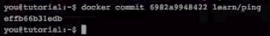

# docker入门

## 1 helloworld

1) 查看版本:

```
docker version
```

2) 通过仓库查找镜像,镜像名为tutorial:

```
docker search turorial
```


3) 从仓库下载镜像:

```
docker pull learn/tutorial
```


这里下载了三个镜像文件.

4) 使用run命令启动容器

```
docker run learn/turorial
```

启动并运行命令

```
docker run learn/turorial echo 'hello world'
```


5) 在容器中安装ping命令

``` 
docker run learn/turorial apt-get install -y ping
```

6) 通过ps来查看docker有哪些容器

```
docker ps -1
```

7) 提交修改的容器

将我们上面修改的容器进行 提交,相当于创建了一个新的镜像.提交的时候要提交哪个容器?这里会有一个固定的id,并且给提交起个名字

```
docker commit id learn/ping
```




返回一个新的id数字,这个是新的镜像的id.

8) 使用新镜像来启动一个容器

```
// 启动并运行ping命令
docker run learn/ping ping www.baidu.com
```


9) 使用ps来查看当前运行的容器

```
docker ps
```

就可以看到刚才运行的容器:


10) 使用inspect查看运行中的容器

```
docker inspect 容器的id(参数)
```

会返回json格式的信息.

11) 查看仓库中有哪些镜像

``` 
docker image
```


12) 把新建立的镜像保存到docker hub中

```
docker push learn/ping
```

保存镜像到仓库中.

## 2 安装部署

1) ubuntu安装

```
sudo apt-get install -y docker.io
```

2) 查看docker版本

```
docker version
```

3) 运行第一个容器

制定容器运行的系统是ubuntu,容器运行后运行的命令:echo 'Hello world'

```
sudo docker run ubuntu echo 'Hello world'
```


4) 给当前用户添加docker用户组

因为每次都是使用root权限来运行,这样很麻烦.所以docker也提供了一个不使用root账户来运行docker的方式.那就是为当前用户添加docker用户组,使用非root用户,具体的配置步骤:

```
sudo groupadd docker // 添加名为docker的用户组
sudo gpasswd -a ${USER} docker// 将当前的用户添加到docker用户组中
sudo service docker restart  // 重启
```


重启电脑,即可生效.安装和配置完成.


