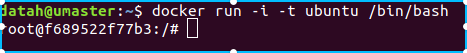
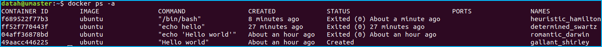
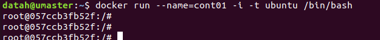
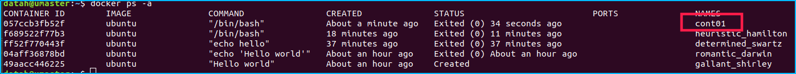
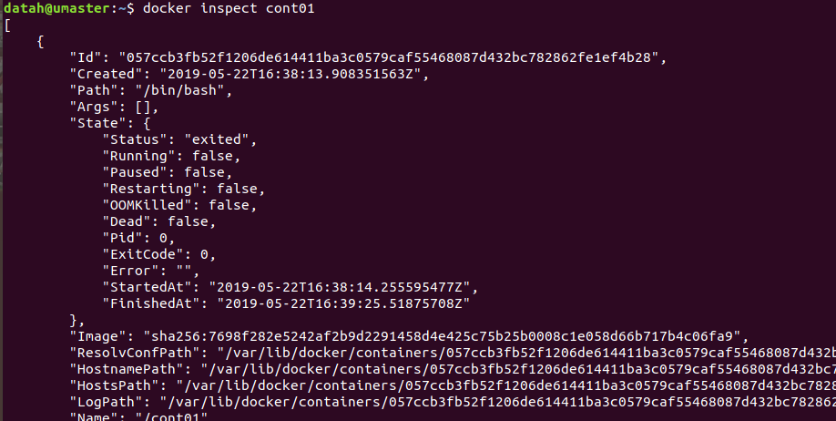
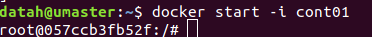
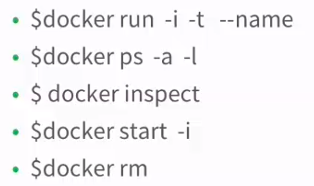

# 容器的基本操作

本文档主要是交互的容器.

## 1 启动容器

### 1.1 执行单次命令的容器

```
docker run IMAGE [COMMAND][ARG...]
```

- IMAGE:操作系统镜像
- \[COMMAND][ARG...]:容器启动后运行的命令和参数

例如:使用ubuntu系统,输出helloworld的命令

```
docker run ubuntu echo 'helloworld'
```

### 1.2 启动交互式容器

```
docker run -i -t IMAGE /bin/bash
```

- /bin/bash:容器启动是执行的命令
- -i :interactive = true | false 默认是 false
- -t :tty = true | false 默认是false,意思是常见tty终端

例如:

```
docker run -i -t ubuntu /bin/bash
```



这样就启动了交互式的容器 ,这样就可以使用类似虚拟机一样使用ubuntu系统了.可以使用exit退出.

## 2 查看容器

### 2.1 查看创建了哪些容器

```
docker ps [-a] [-l]
```

- -a:列出所有的容器
- -l:列出最新创建的容器

> 不指定参数时候,返回的是正在运行的容器

例如:查看所有的容器

```
docker ps -a
```



最上面的两个容器是刚刚运行过的容器.

### 2.2 查看已经建立的容器

```
docker inspect 参数
```

- 参数可以是容器的id,或者容器的名字

会返回json格式的信息.

## 3 自定义容器名字

```
docker run --name=自定义名 -i -t IMAGE /bin/bash
```

例如:



退出 ,查看:



使用inspect查看:



## 4 重新启动停止的容器

```
docker start [-i] 容器名
```

- -i:表示以交互的方式重新启动容器



## 5 删除已经停止的容器

只能删除已经停止的容器,不能删除正在运行的容器.

```
docker rm 容器名
```

## 小结



