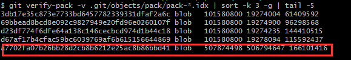
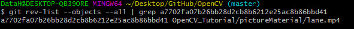

**前言**

Git 作为一个分布式的版本管理工具，代码仓库中是会保存所有历史记录的。虽然，Git 的 .gitignore 文件里可以定义一些忽略文件的规则，但是，在我们提交代码的过程中，总会不小心误提一些没用的文件，如果文件中存在大文件，就会导致：就算我们把它删了重新提交，.git 文件夹依然会占用较大的空间。

如何解决这个问题呢？其实，Git 已经为我们提供了解决方案，就是被称为核弹级的命令 filter-branch。这个命令可以用来修改历史提交记录，把不需要的文件永久地从历史记录中删除。

**方法如下：**

首先，我们需要找出大文件。

找出排名前 5 的 pack 记录：

```
git verify-pack -v .git/objects/pack/pack-*.idx | sort -k 3 -g | tail -5
```

可以看到这样的信息：



最后一条就是最大的一条记录,第一行是它的id。
找出该记录对应的文件：

```
 git rev-list --objects --all | grep a7702fa07b26bb28d2cb8b6212e25ac8b86bbd41
```

可以看到：



它占了有 500多 M 的空间。将该文件从历史记录中移除:

```
 git log --pretty=oneline --branches --  OpenCV_Tutorial/pictureMaterial/lane.mp4
```

重写所有 commit，将该文件从 Git 历史中完全移除：

```
git filter-branch --index-filter 'git rm --cached --ignore-unmatch OpenCV_Tutorial/pictureMaterial/lane.mp4' -- --all
```

到这里，历史记录中已经没有该文件了。不过运行 filter-branch 产生的日志还是会对该文件有引用，所以还需要运行以下几条命令，把该文件的引用完全删除：

```
rm -Rf .git/refs/original
rm -Rf .git/logs/
git gc
git prune
```

这个时候，再看文件夹，已经小了很多了。然后就可以 push 代码了，不过就是需要强制 push：

```
git push --force
```

以上就是删除 Git 历史记录中大文件的过程。

当然 filter-branch 的作用还不止这些，比如它还可以用来修改历史提交记录中的用户名(username)和邮箱(email)等。